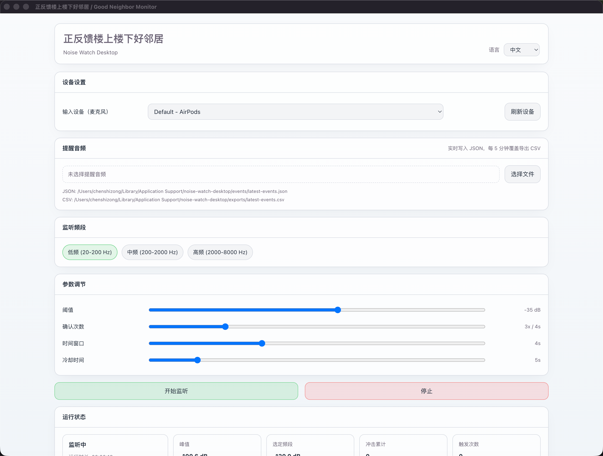
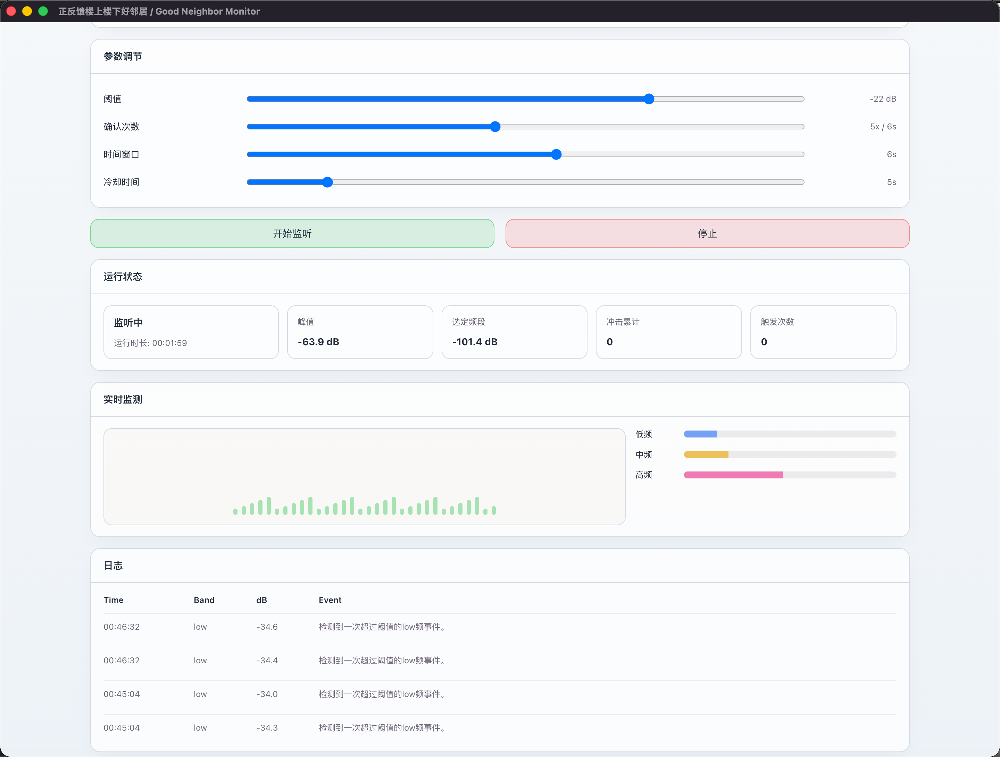

# 正反馈楼上楼下好邻居（Noise Watch Desktop）

一个用于 **Windows / macOS** 的桌面监听提醒工具。

## 当前支持

- 支持平台：**macOS、Windows**
- 支持程序形态：**桌面应用（Electron）**
- 支持输入：**麦克风输入设备选择与刷新**
- 支持监听频段：**低频 / 中频 / 高频**
- 支持规则：**阈值 + 次数 + 时间窗口 + 冷却时间**
- 支持提醒：**本机自定义提醒音频播放**
- 支持数据落地：**实时 JSON + 每 5 分钟自动覆盖导出 CSV**
- 支持界面语言：**中文 / English**

---

## 项目截图

### 界面上半部分



### 界面下半部分



---

## 功能说明

这是一个跨平台桌面应用（Windows / macOS），用于：

- 选择麦克风输入设备并实时监听
- 选择监听频段：低频 / 中频 / 高频
- 按“阈值 + 次数 + 时间窗口 + 冷却时间”的规则进行事件判定
- 触发后在**本机**播放提醒音（你自己选择音频文件）
- 运行过程中实时写入本地 JSON
- 每 5 分钟自动导出并覆盖一份 CSV（便于后续查看/取证）

> 说明：本项目仅用于本机提醒与记录。

---

## 开发环境要求

- Node.js（建议 18+，你当前环境已可用）
- macOS / Windows

---

## 安装依赖

在项目根目录执行：

```bash
npm install
```

---

## 开发模式启动（推荐）

```bash
npm run dev
```

会打开 Electron 窗口。

首次启动可能会弹出系统权限请求（麦克风），请选择允许。

---

## 打包发布（生成安装包）

```bash
npm run dist
```

打包完成后会在 `dist/` 下生成：

- macOS：`dist/*.dmg` 以及 `dist/mac-*/xxx.app`
- Windows：`dist/*.exe`（在 Windows 上打包时生成）

---

## 为什么我“看不到 app”？

如果你之前打过包，后来又运行了 `npm run build`，Vite 会清理输出目录，导致打包产物（.app/.dmg）被覆盖/删除。

本项目已做了调整：

- 前端构建输出到：`dist/renderer/`
- 安装包输出到：`dist/`

所以之后再运行 `npm run build` 不会把 `.dmg/.app` 删掉。

---

## 本地数据保存位置

应用运行时会写到系统的 `userData` 目录（Electron 标准路径）。

- 实时 JSON（覆盖写）：`events/latest-events.json`
- 每 5 分钟 CSV（覆盖写）：`exports/latest-events.csv`

在界面中也会显示 JSON/CSV 实际文件路径。

---

## 常见问题

### 1）macOS 提示“无法打开/来自未知开发者”

这是未签名应用的常见提示。按这个路径处理：

- 系统设置 → 隐私与安全性
- 找到被拦截的应用提示
- 点击“仍要打开”

### 2）监听不到设备/设备名称为空

浏览器/系统有时需要先获取一次麦克风权限，设备 label 才会显示完整。

### 3）为什么显示的是负数 dB？

当前界面显示的是 **dBFS**（数字音频相对满刻度的分贝），不是现实世界校准后的 dB SPL。

- `0 dBFS`：数字系统允许的最大值
- `-70 dBFS`：表示当前输入很弱，但这是正常现象
- 越接近 `0`，说明当前音频越强

---

## 开源协议

本项目使用 **MIT License**。

---

## 目录结构（简化）

- `electron/`：Electron 主进程与 preload
- `src/`：React UI + 监听/判定逻辑
- `scripts/`：开发启动辅助脚本
- `docs/`：README 图片等文档资源
- `dist/renderer/`：前端构建产物
- `dist/`：electron-builder 打包输出

---

## 如果这个项目对你有帮助

欢迎给仓库点一个 **Star**，这会非常有帮助。
